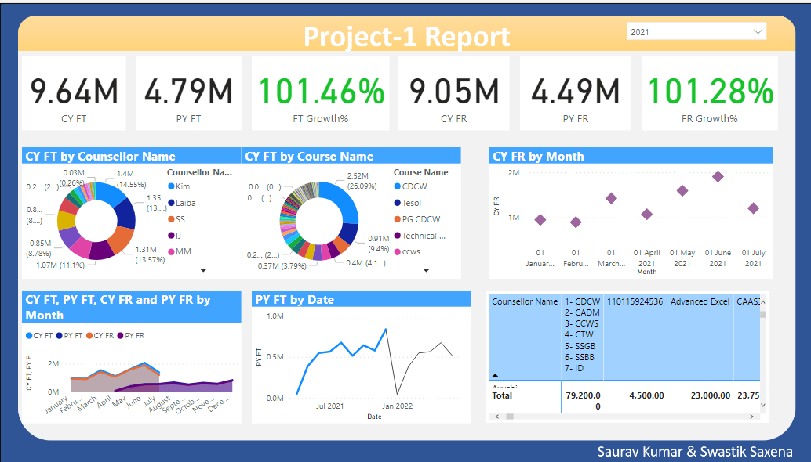

# Sales-Forecasting
Deep Comparative Analysis on time series Data.


<!-- PROJECT SHIELDS -->
<!--
*** I'm using markdown "reference style" links for readability.
*** Reference links are enclosed in brackets [ ] instead of parentheses ( ).
*** See the bottom of this document for the declaration of the reference variables
*** for contributors-url, forks-url, etc. This is an optional, concise syntax you may use.
*** https://www.markdownguide.org/basic-syntax/#reference-style-links
-->

[![LinkedIn][linkedin-shield]][linkedin-url]


<!-- PROJECT LOGO -->
<br />
<p align="center">
  <a href="https://github.com/Saurav-Raghaw/ML16-Recommendation-Sysytem">
    
  </a>

  <h3 align="center">Revenue Forecasting</h3>

  <p align="center">
    A similar movie recommendation based on your search!
    <br />
    <a href="https://github.com/Saurav-Raghaw/ML16-Recommendation-Sysytem"><strong>Explore the docs »</strong></a>
    <br />
    <br />
    
  </p>
</p>


<!-- TABLE OF CONTENTS -->
<details open="open">
  <summary>Table of Contents</summary>
  <ol>
    <li>
      <a href="#about-the-project">About The Project</a>
      <ul>
        <li><a href="#built-with">Frameworks</a></li>
      </ul>
    </li>
    <li>
      <a href="#getting-started">Getting Started</a>
      <ul>
        <li><a href="#prerequisites">Prerequisites</a></li>
        <li><a href="#installation">Installation</a></li>
      </ul>
    </li>
    <li><a href="#usage">Usage</a></li>
    <li><a href="#license">License</a></li>
    <li><a href="#contact">Contact</a></li>
    <li><a href="#acknowledgements">Acknowledgements</a></li>
  </ol>
</details>


<!-- ABOUT THE PROJECT -->
## About The Project


As we know, a recommender system is an information filtering system that seeks to predict the rating given by a user to an item. This predicted rating is then used to recommend items to the user. The item for which the predicted rating is high will be recommended to the user.

Step 1: Importing necessary libraries.
Step 2: Data Cleaning.
Step 3: Feature Enginnering.
Step 4: Defining Data Models and Evaluating.


Various Forecasting Models:
1. Naïve model: In this model the forecasting values of new data is same as the value of last known data. For example, If we have last month fees in training data as 1000, then for all the coming months the same fees will be forecasted.
2. Moving average: In this method, we take average of some last observations and forecasting in done on that basis.For eg, we have done experiment by taking last 3, 5 and 10 observations.
3. Simple Exponential Smoothing: In Exponential Smoothing, the far observations get less weightage and recent observations got more weightage.
4. Holts Linear Trend Model: In this method, we take trend of data also into consideration with simple exponential smoothing.
5. Holt's Winter Model: The previous methods doesn’t take seasonality into account. This method takes trend and seasonality both to predict future fees.

Movie Recommendation

<p align="center">
    Screenshot-1
    <br />
    
  </p>
<br />
<p align="center">
  <a href="https://github.com/Saurav-Raghaw/ML16-Recommendation-Sysytem">
    
  </a>

</p>


<br />

Movie Review

<p align="center">
    Screenshot-6
    <br />
</p>
<br />
<p align="center">
  <a href="https://github.com/Saurav-Raghaw/ML16-Recommendation-Sysytem">
    
  </a>

</p>

<br />

<p align="center">
    Screenshot-7
    <br />
</p>
<br />
<p align="center">
  <a href="https://github.com/Saurav-Raghaw/ML16-Recommendation-Sysytem">
    
  </a>

</p>

<br />

Codes Screenshots

<p align="center">
    Screenshot-8
    <br />
</p>
<br />
<p align="center">
  <a href="https://github.com/Saurav-Raghaw/ML16-Recommendation-Sysytem">
    
  </a>

</p>

<br />

<p align="center">
    Screenshot-9
    <br />
</p>
<br />
<p align="center">
  <a href="https://github.com/Saurav-Raghaw/ML16-Recommendation-Sysytem">
    
  </a>

</p>

<br />

<p align="center">
    Screenshot-9
    <br />
</p>
<br />
<p align="center">
  <a href="https://github.com/Saurav-Raghaw/ML16-Recommendation-Sysytem">
    
  </a>

</p>

<br />


### Frameworks used

We have used the following frameworks for our project
* [Python](https://www.python.org/)
* [PyTorch](https://pytorch.org/)


### Prerequisites

This is an example of how to list things you need to use the software and how to install them.
1. Install Pandas
  ```sh
  !pip install pandas
  ```
2. Install NumPy
 ```sh
 !pip install numpy
 ```
3. Install Flask
```sh
!pip install flask
```

### Installation

1. Get a free API Key at [Here](https://developers.themoviedb.org/3/getting-started/introduction)
2. Clone the repo
   ```sh
   git clone https://github.com/Saurav-Raghaw/ML16-Recommendation-Sysytem
   ```
3. Update your API and Main File 
   ```sh
   const API_KEY = 'ENTER YOUR API';
   ```
4. Command to Run
   ```sh
   python main.py
   ```
  


<!-- CONTRIBUTING -->


<!-- LICENSE -->
## License

Distributed under the MIT License. See `LICENSE` for more information.


<!-- CONTACT -->
## Team Details


* Saurav Kumar
[![LinkedIn][linkedin-shield]][linkedin-url]  [![GitHub][github-shield]][github-url] 


<!-- ACKNOWLEDGEMENTS -->
## Acknowledgements
* [MATRIX FACTORIZATION TECHNIQUES FOR RECOMMENDER SYSTEMS](https://www.linkedin.com/posts/saurav-kumar-78b97920a_recommender-system-netflix-activity-6814943939448102912-3Mjh/)
* [Fundamental of Matrix Factorization For Recommender System](https://www.linkedin.com/pulse/fundamental-matrix-factorization-recommender-system-saurav-kumar/)
* [Img Shields](https://shields.io)
* [Choose an Open Source License](https://choosealicense.com)
* [GitHub Pages](https://pages.github.com)


<!-- MARKDOWN LINKS & IMAGES -->
<!-- https://www.markdownguide.org/basic-syntax/#reference-style-links -->
[contributors-shield]: https://img.shields.io/github/contributors/othneildrew/Best-README-Template.svg?style=for-the-badge
[contributors-url]: https://github.com/Saurav-Raghaw/ML16-Recommendation-Sysytem/graphs/contributors
[forks-shield]: https://img.shields.io/github/forks/othneildrew/Best-README-Template.svg?style=for-the-badge
[forks-url]: https://github.com/Saurav-Raghaw/ML16-Recommendation-Sysytem/network/members
[stars-shield]: https://img.shields.io/github/stars/othneildrew/Best-README-Template.svg?style=for-the-badge
[stars-url]: https://github.com/Saurav-Raghaw/ML16-Recommendation-Sysytem/stargazers
[issues-shield]: https://img.shields.io/github/issues/othneildrew/Best-README-Template.svg?style=for-the-badge
[issues-url]: https://github.com/Saurav-Raghaw/ML16-Recommendation-Sysytem/issues
[linkedin-shield]: https://img.shields.io/badge/LinkedIn-0077B5?style=for-the-badge&logo=linkedin&logoColor=white
[linkedin-url]: https://www.linkedin.com/in/saurav-kumar-78b97920a/
[github-shield]: https://img.shields.io/badge/GitHub-100000?style=for-the-badge&logo=github&logoColor=white
[github-url]: https://github.com/Saurav-Raghaw
[github2-url]: https://github.com/sswastik630
[linkedin2-url]: https://www.linkedin.com/in/swastik-saxena-448b5817b/
[github3-url]: https://www.linkedin.com/in/rupesh-kumar-316848121
[linkedin3-url]: https://github.com/rupeshkmr
[product-screenshot]: images/screenshot.png

